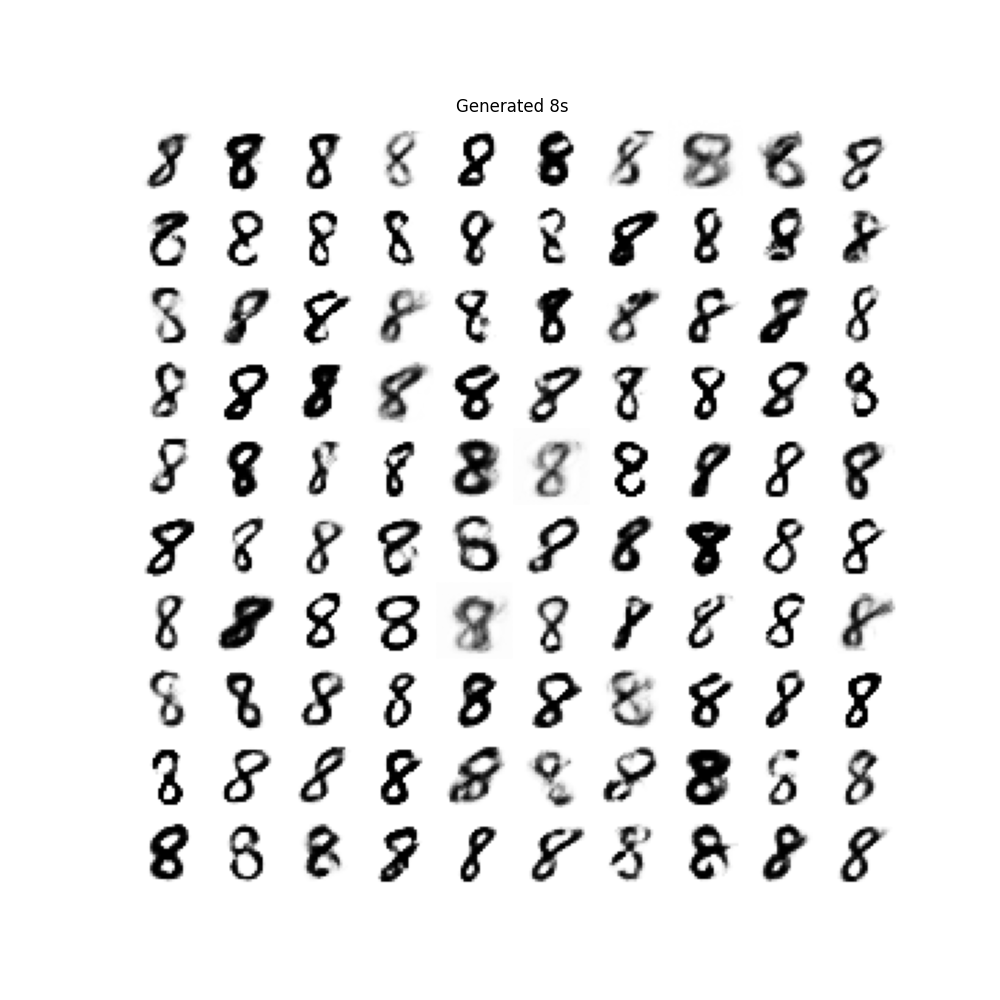

# Generative Model for Handwritten 8s  

## Description  
This project implements a generative model using a fully connected neural network to generate images of the handwritten numeral "8". The network consists of:  
- A hidden layer with ReLU activation  
- An output layer with a sigmoid activation  
- A given dataset (`data.mat`) that provides the model parameters  

## Dataset  
The file `data.mat` contains:  
- `A1` (128 × 10) and `A2` (784 × 128): Weight matrices  
- `B1` (128 × 1) and `B2` (784 × 1): Bias vectors  

## Equations  
The generative process follows these steps:  

1. Compute the first-layer output:  
   ```math
   W1 = A1 * Z + B1
   ```
2. Apply ReLU activation:
   ```math
   Z1 = max\{W1,0\} (ReLU)
   ```
3. Compute the second-layer output:
   ```math
   W2 = A2 * Z + B2
   ```
4. Apply Sigmoid activation:
   ```math
   X = 1./(1 + exp(W2)) (Sigmoid)
   ```

The output X is a 784×1 vector representing the image, which can be reshaped into a 28×28 grayscale image.

## Installation and Setup

### 1. Clone the repository:
```git clone https://github.com/yourusername/Problem-2.1-Generative-Model.git```

### 2. Install dependencies:
```pip install numpy scipy matplotlib```

### 3. Run the script:
```python gan.py```

## Output
The script generates 100 images of the digit "8" and arranges them in a 10×10 grid. The final output will be displayed using matplotlib.

<p align="center"> 
 
</p>
